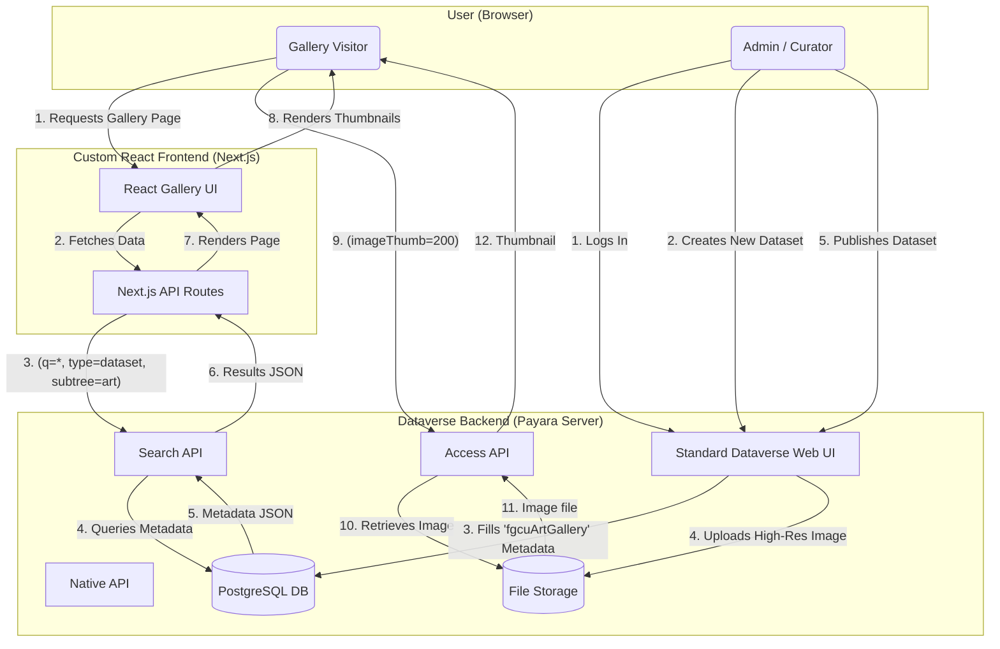

**System Architecture: FGCU Art Gallery**

This document outlines the system architecture for the FGCU Art Gallery, which employs a decoupled, "headless" model.

This architecture consists of two primary, independent components:
1.  **Frontend Application:** A custom-built React (Next.js) web application that serves as the public-facing user interface.
2.  **Backend System:** The existing Dataverse installation, which functions as the core content repository, data-persistence layer, and API provider.

All communication between the frontend and backend is handled exclusively through the Dataverse REST APIs.

**Key Architectural Flows**

This system operates on two distinct data flows: a read-only flow for the public frontend and a write-only flow for backend administration.

**1. Frontend Read Flow (Public Gallery)**

This flow describes how public visitors interact with the system through the custom React frontend. The process relies entirely on Dataverse’s REST APIs to retrieve and display published artwork data.
1. **Access Gallery:** A visitor opens the FGCU Art Gallery web application built with React (Next.js).
2. **Fetch Data:** The frontend's UI calls its own Next.js API route. That route, in turn, queries the Dataverse Search API (/api/search) to retrieve a paginated list of artworks.  
   These results include metadata and configured facet fields (e.g., Artist, Medium, Year) for filtering.
3. **Browse & Filter:** Users interact with the gallery grid, using the available facets to narrow results by metadata fields.
4. **View Artwork Details:** When an artwork is selected, the frontend retrieves the full dataset metadata from the Native API (/api/datasets/:persistentId/versions/:latest).  
   This response provides detailed information from the custom fgcuArtGallery metadata block.
5. **Display Images:** The React app displays artwork images using the Access API (/api/access/datafile/{id}?imageThumb=N) for thumbnails and previews.
6. **Download File:** The “Download” button links directly to the Access API, allowing users to download the original, high-resolution image or media file.

Once data is retrieved from the APIs, the React frontend renders it dynamically, ensuring that any newly published artwork in Dataverse appears automatically in the public gallery.

**2. Backend Write Flow (Content Administration)**

This flow describes how new artworks are added to the system. This process intentionally bypasses the React frontend to leverage Dataverse's existing content management features.

1.  **Login:** An administrator logs into the Standard Dataverse Web UI.
2.  **Create Dataset:** The admin creates a new dataset for each individual artwork.
3.  **Populate Metadata:** The admin fills in the fields defined in our custom fgcuArtGallery metadata block (Artist, Title, Medium, Copyright, etc.).
4.  **Upload File:** The admin uploads the high-resolution image or audio file to the dataset.
5.  **Publish:** The admin "Publishes" the dataset. This action commits the metadata to the database and makes the dataset and its files accessible via the public Search, Native, and Access APIs.

Once published, the new artwork automatically appears in the custom React frontend upon its next API query.
